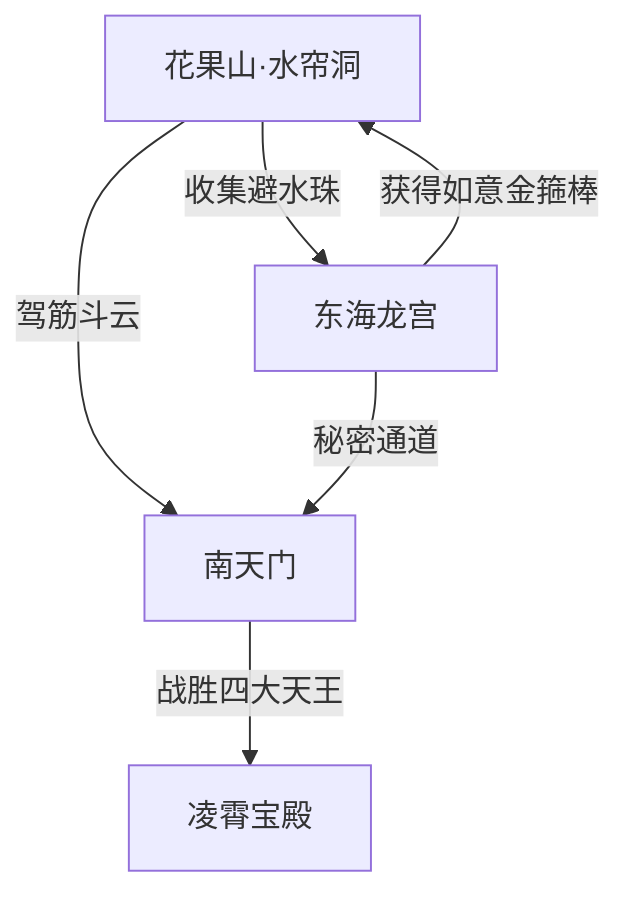

你好！我是 Antigravity。作为一名经验丰富的游戏场景设计师，我为你精心策划了《西游世界》的场景设计文档。

本方案旨在通过 **Q版卡通** 的视觉风格，传达“当一只开心马喽”那种无忧无虑、搞怪且充满惊喜的氛围。

---

# 《西游世界》场景设计文档 (Scene Design Document)

## 1. 场景列表

### 场景 A：花果山·水帘洞前 (新手村/主基地)
*   **基本描述**: 阳光明媚的世外桃源，马喽们的乐园。到处是巨大的桃子和可以荡秋千的藤蔓。
*   **场景总尺寸**: 3840 x 1080 (横向卷轴式长场景)
*   **布局布局 (Layout Structure)**:
    *   **左侧区域 (生活区)**: 坐标 (0, 0) 到 (1200, 1080)。地势平缓，布满了巨大的吊床草堆。
    *   **中间区域 (核心地标)**: 坐标 (1200, 0) 到 (2600, 1080)。中央是一个巨大的瀑布（水帘洞入口），瀑布前有一个 600x300 的半圆形石台。
    *   **右侧区域 (修行区)**: 坐标 (2600, 0) 到 (3840, 1080)。地势升高，有多个高低错落的悬浮石块和木桩练习场。
    *   **远景**: 远方是连绵的翠绿山峰和漂浮的卡通云朵。
*   **地块与物件清单**:
    *   **核心建筑**: 位于 (1920, 540) 的水帘洞瀑布（包含动态粒子效果）。
    *   **植被**: 
        *   左侧分布 5 棵巨大的“仙桃树”（高 400px），树上挂着比猴头还大的粉色桃子。
        *   全场景分布可交互的“弹跳蘑菇”（直径 100px），踩上去可跳跃。
    *   **装饰物**: 
        *   (600, 800) 处有一个巨大的石制猴王宝座。
        *   背景中散落着 10 根可攀爬的紫色藤蔓。

### 场景 B：东海龙宫 (探险/解谜)
*   **基本描述**: 充满气泡和发光珊瑚的海底世界，色彩斑斓，地面有轻微的浮力反馈。
*   **场景总尺寸**: 1920 x 1920 (垂直与水平兼顾的正方形场景)
*   **布局布局 (Layout Structure)**:
    *   **底部区域 (海床)**: (0, 1400) 到 (1920, 1920)。布满细沙和彩色贝壳，是玩家进入的起点。
    *   **中部区域 (珊瑚迷宫)**: (0, 600) 到 (1920, 1400)。由巨大的发光珊瑚组成的错综复杂的路径。
    *   **顶部区域 (龙王殿)**: (400, 0) 到 (1500, 600)。一座巨大的半透明水晶宫殿，位于场景的最上方。
*   **地块与物件清单**:
    *   **核心建筑**: (960, 300) 处的“水晶宫主殿”，半透明材质，内部可见旋转的定海神针（Q版）。
    *   **植被**: 
        *   遍布场景的“发光海草”（随水流摆动）。
        *   (200, 1500) 处有一丛巨大的“气泡珊瑚”，定时喷出可包裹玩家上升的气泡。
    *   **装饰物**: 
        *   (1600, 1600) 有一个巨大的张口蚌壳（内含珍珠宝箱）。
        *   场景四周有成群游动的彩色Q版小鱼。

### 场景 C：南天门 (高难度挑战/Boss战)
*   **基本描述**: 位于云端的宏伟建筑，白玉铺地，金光闪闪，但风格圆润可爱。
*   **场景总尺寸**: 2560 x 1440
*   **布局布局 (Layout Structure)**:
    *   **前庭区域**: (0, 1000) 到 (2560, 1440)。由大块的白色方砖铺成的广场。
    *   **中场区域**: (800, 400) 到 (1760, 1000)。一段宽阔的汉白玉阶梯，直通大门。
    *   **背景区域**: 两侧是浮动的仙岛，通过彩虹桥连接。
*   **地块与物件清单**:
    *   **核心建筑**: (1280, 400) 处高达 800px 的“南天门”牌坊，两根柱子上缠绕着胖乎乎的金龙。
    *   **装饰物**: 
        *   门两侧各有一尊 300x300 的石狮子（表情是呆滞的萌感）。
        *   广场边缘分布着 8 个“长明灯座”，发出淡金色的光晕。
        *   地面覆盖着一层厚度约 50px 的动态“流云层”。

---

## 2. 场景流转图 (Scene Flow)

---

## 3. 视觉气氛 (Visual Atmosphere)

| 场景名称 | 主色调 | 光照强度 | 视觉特征 |
| :--- | :--- | :--- | :--- |
| **花果山** | 翠绿色、粉色 | 高 (明亮日光) | 饱和度高，充满生机，光影柔和。 |
| **东海龙宫** | 湖蓝色、荧光紫 | 中 (波光粼粼) | 带有水下折射焦散效果，物体有发光边缘。 |
| **南天门** | 金色、乳白色 | 极高 (神圣金光) | 伴随丁达尔效应（佛光），云雾缭绕。 |
| **白骨岭** | 深紫色、幽蓝色 | 低 (月光/冷光) | 鬼火点缀，虽然是卡通风格但略带神秘感。 |

---

## 4. 背景音乐建议 (BGM Suggestions)

*   **花果山**: 
    *   *风格*: 欢快、民族管弦。
    *   *乐器*: 竹笛、木琴、小鼓。
    *   *感受*: 像是在森林里蹦跳的节奏，轻快活泼。
*   **东海龙宫**:
    *   *风格*: 梦幻、空灵。
    *   *乐器*: 竖琴、马林巴、合成器垫音。
    *   *感受*: 咕噜噜的水声采样，节奏舒缓，有沉浸感。
*   **南天门**:
    *   *风格*: 宏伟、进行曲。
    *   *乐器*: 唢呐（高音Q版化）、大号、编钟。
    *   *感受*: 既有天宫的威严，又不失马喽闹天宫的调皮感。

---

这份文档为开发团队提供了清晰的视觉和空间参考。如果你需要针对某个特定关卡进行更深入的**数值设计**或**交互逻辑**补充，请随时告知！