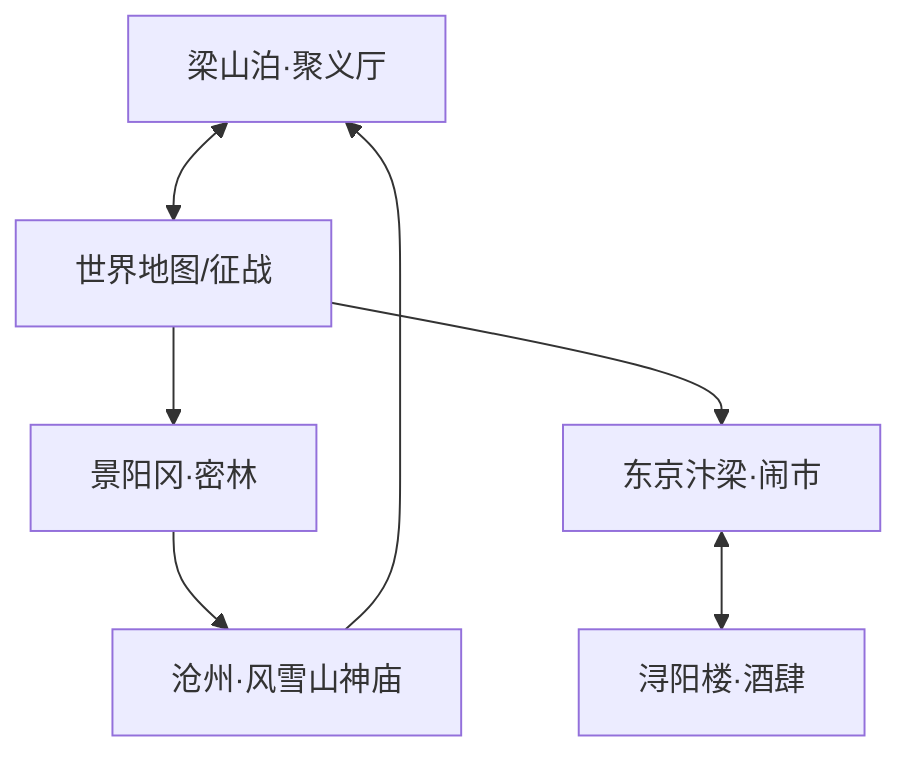

你好！我是 Antigravity。作为一名深耕像素艺术风格的游戏场景设计师，我为你构思了《水浒世界》的场景设计文档。

本方案旨在结合**北宋末年的市井气息**与**江湖草莽的豪情**，利用像素艺术特有的“颗粒感”和“光影对比”来强化视觉张力。

---

# 《水浒世界》场景设计文档 (Pixel Art Edition)

## 1. 场景列表 (Scene List)

| 场景名称 | 氛围描述 | 尺寸规格 | 核心功能 |
| :--- | :--- | :--- | :--- |
| **梁山泊·聚义厅** | 雄伟、庄重、英雄集结的豪气 | 1280x720 (大场景/主基地) | 任务接取、角色养成、剧情推进 |
| **景阳冈·密林** | 阴森、肃杀、危机四伏 | 2560x480 (横向长卷) | 战斗关卡、Boss战(虎) |
| **东京汴梁·闹市** | 繁华、喧嚣、市井烟火气 | 1920x1080 (多层卷轴) | 交易、信息收集、潜入任务 |
| **沧州·风雪山神庙** | 凄凉、绝望中爆发的杀意 | 960x540 (紧凑型场景) | 关键节点战斗、情感转折 |
| **浔阳楼·酒肆** | 文人墨客与江湖游侠的交汇 | 640x480 (精致室内) | 招募英雄、小游戏、剧情对话 |

---

## 2. 场景元素 (Scene Elements)

### 2.1 梁山泊·聚义厅
*   **可交互元素：**
    *   **替天行道大旗：** 点击可查看阵营声望与排行榜。
    *   **交椅：** 108把交椅，对应已解锁的英雄，点击可切换出战角色。
    *   **沙盘：** 开启世界地图进行征战。
*   **装饰元素：**
    *   跳动的篝火堆（像素动画）、堆积如山的酒坛、悬挂的各色兵器、粗犷的石柱浮雕。

### 2.2 景阳冈·密林
*   **可交互元素：**
    *   **枯树枝：** 踩踏会发出声响，吸引野兽。
    *   **猎人陷阱：** 可触发用于限制敌方移动。
    *   **告示牌：** “近因景阳冈大虫伤人...” 触发背景剧情。
*   **装饰元素：**
    *   随风摇摆的枯草、遮挡视线的浓雾层（Parallax Layers）、偶尔掠过的惊鸟。

### 2.3 东京汴梁·闹市
*   **可交互元素：**
    *   **路边摊位：** 购买包子、伤药、暗器。
    *   **告示榜：** 领取通缉任务。
    *   **勾栏瓦舍入口：** 进入观看表演或触发支线。
*   **装饰元素：**
    *   层叠的瓦片屋顶、随风飘动的布幌子、路边叫卖的像素小人（NPC）、远景中的大相国寺轮廓。

---

## 3. 场景流转 (Scene Flow)

---

## 4. 视觉设计 (Visual Design)

### 4.1 场景详细视觉描述 (AI 生成提示参考)

*   **[梁山泊] 视觉描述：** 
    *   **主色调：** 赭石色、暗金色、深蓝色。
    *   **光照：** 强烈的室内火把光效，形成高对比度的动感阴影。
    *   **天气：** 室外远景为水汽氤氲的湖泊，伴有微弱的波浪像素动画。
    *   **AI生成参考：** *Pixel art, interior of a grand Chinese mountain fortress, rows of wooden chairs, a giant flag with "Justice" kanji, flickering torches, dark wood textures, 16-bit aesthetic.*

*   **[风雪山神庙] 视觉描述：**
    *   **主色调：** 极地蓝、纯白、血红色（对比）。
    *   **光照：** 冷色调月光，透过破碎窗户射入的冷光。
    *   **天气：** 狂暴的像素雪花粒子，遮蔽视线，地面有积雪覆盖效果。
    *   **AI生成参考：** *Pixel art, a dilapidated ancient Chinese temple in a heavy snowstorm, night time, a single glowing lantern, blood stains on white snow, cinematic lighting, melancholic atmosphere.*

---

## 5. 背景音乐建议 (BGM Suggestions)

| 场景 | 音乐风格建议 | 乐器元素 |
| :--- | :--- | :--- |
| **梁山泊** | 豪迈、节奏感强、合奏 | 唢呐（主旋律）、大鼓、古筝 |
| **景阳冈** | 压抑、低沉、悬疑 | 箫（空灵感）、快速的琵琶碎音 |
| **东京汴梁** | 欢快、富有生活气息 | 笛子、三弦、市井环境音（叫卖声采样） |
| **风雪山神庙** | 悲凉、肃杀、史诗感 | 二胡（凄凉旋律）、重击的鼓点（预示战斗） |
| **浔阳楼** | 悠扬、清雅 | 古琴、轻微的杯盏碰撞声 |

---

### 设计师寄语：
在像素风的《水浒世界》中，我们不追求写实的精度，而追求**意境的传达**。通过像素点的抖动（Dithering）来表现宋代布料的质感，利用有限的色彩数（Palette）来营造不同地域的地域感。每一个场景都应像一幅流动的像素工笔画。

你对哪个场景的细节最感兴趣？我可以为你进一步细化该场景的关卡设计。